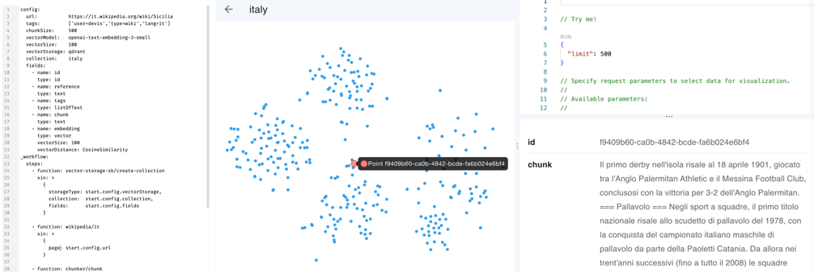

# Generative Pipelines

**Generative Pipelines** is an **HTTP-driven orchestrator** for creating, testing, and refining
**AI-powered workflows** through structured sequences of small and reusable steps.
It's focused on modular and function-based execution of HTTP APIs to process, store, retrieve,
augment, and query multimodal data.

**Generative Pipelines is a development tool** designed for rapid iteration and local development
with minimal to no configuration, enabling:

- **Simplicity and Velocity**: pipelines are defined on the fly without deployments.
  Add logic, adjust parameters, and test instantly.
- **Language agnostic**: create orchestrations over HTTP and APIs, from any platform.
- **Local-first Dev Experience**: use .NET Aspire for infrastructure, with built-in logging and
  telemetry.

> [!IMPORTANT]
> This project is under active development and may introduce breaking changes without notice.

# Core Concepts

The framework provides a **set of composable web services** that act as independent **Tools**.
Tools can contain a single function or multiple functions. These functions are orchestrated into
**custom pipelines** to handle tasks such as data ingestion, transformation, storage, retrieval,
and analysis.

- **Tools** are web services
- **Functions** are HTTP endpoints
- Functions are composed into pipelines / workflows
- **The Orchestrator is the only web service that clients interact with**. Clients send
  a pipeline definition, including the data to process, and the orchestrator immediately
  executes.
- Pipelines are completely configured in the request payload. The orchestrator dynamically
  routes requests to functions, preparing input and collecting output from each function.

## Key Characteristics:

- Designed for short and long-running **Information Processing** tasks. Supports real-time streaming,
  long-running background tasks, and non-blocking operations for pipelines that require minutes or
  hours to complete.
- **Web Service-based execution**: Functions operate as standalone web services, enabling local
  execution, distributed deployment, and cloud-native scalability.
- **Extensibility**: New functions can be implemented and deployed as web services with a simple
  interface, dynamically registered into the orchestrator, which manages request routing and
  execution flow. Different storage types can be easily integrated using dedicated functions.
- **Composable Invocation**: Clients can invoke single functions for atomic operations or chain
  multiple functions to build complex memory pipelines.

> [!NOTE]
> The project is a work in progress, with some features still under development.

# Documentation

- [docs/PIPELINES-INTRO.md](docs/PIPELINES-INTRO.md): Introduction to pipelines and workflows.
- [docs/CONVENTIONS.md](docs/CONVENTIONS.md): Conventions and best practices for
  defining pipelines.
- [docs/QUICKSTART.md](docs/QUICKSTART.md): A ten-minutes overview to quickly set up and test the project
  before exploring advanced topics.
- [docs/EXAMPLE-RAG-INGESTION.md](docs/EXAMPLE-RAG-INGESTION.md): Example of a pipeline for RAG ingestion.
- [docs/DEVELOPMENT.md](docs/DEVELOPMENT.md): Developer setup, how to create and test tools and workflows.
- [docs/JMESPATH.md](docs/JMESPATH.md)
- [docs/DEPLOYMENT.md](docs/DEPLOYMENT.md): How to deploy the project to Azure.

# Examples

The repository includes several examples in different formats, starting from basic concepts to complete
solutions:

- [**Introduction to the pipeline syntax**](docs/PIPELINES-INTRO.md).
- [Basic tutorial using JSON and YAML syntax](docs/CONVENTIONS.md).
- [**10 small examples** using JSON syntax](docs/EXAMPLES.md).
- [Document ingestion with LLM embeddings pipeline using YAML syntax, **Python and C# clients**](docs/EXAMPLE-RAG-INGESTION.md).
- [Collection of HTTP requests](examples/bruno) using [Bruno HTTP client](https://www.usebruno.com)

# Use Cases

The project serves as a foundational framework for enhancing AI-powered applications and enables
the implementation of advanced memory-driven solutions, for example:

- **Retrieval-Augmented Generation (RAG):**
    - Classic text+embeddings RAG.
    - Structured RAG: Schema-enriched retrieval.
    - Graph RAG: Knowledge-graph-driven retrieval augmentation.
- **Adaptive Memory Systems:**
    - Self-tuning contextual memory: Dynamic selection and pruning of relevant data for
      context-aware AI interactions.
    - Long-term memory management: storage, retrieval, and cleanup of accumulated knowledge.
- **Agentic Memory** exploration
- **Composition of tools** written in different languages (.NET, Node.js, Python, etc.)

### Screenshots from the RAG ingestion sample using Qdrant

# Cloud and Production deployments

Generative Pipelines is a development tool for exploring service patterns and testing
functional composition in **local or private environments**.
While technically possible, it is **not intended to run production services**.

See [docs/DEPLOYMENT.md](docs/DEPLOYMENT.md) for details.

# Continue Reading

Dive into [docs/PIPELINES-INTRO.md](docs/PIPELINES-INTRO.md) to learn more.
