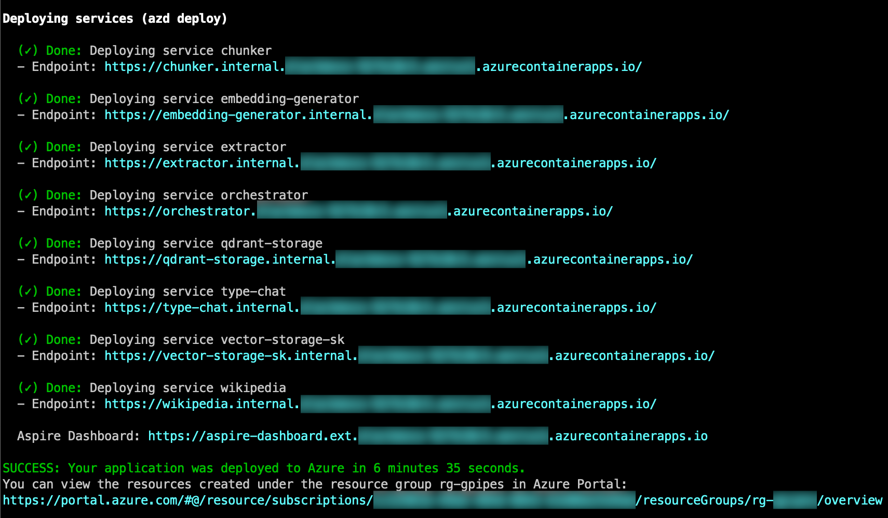
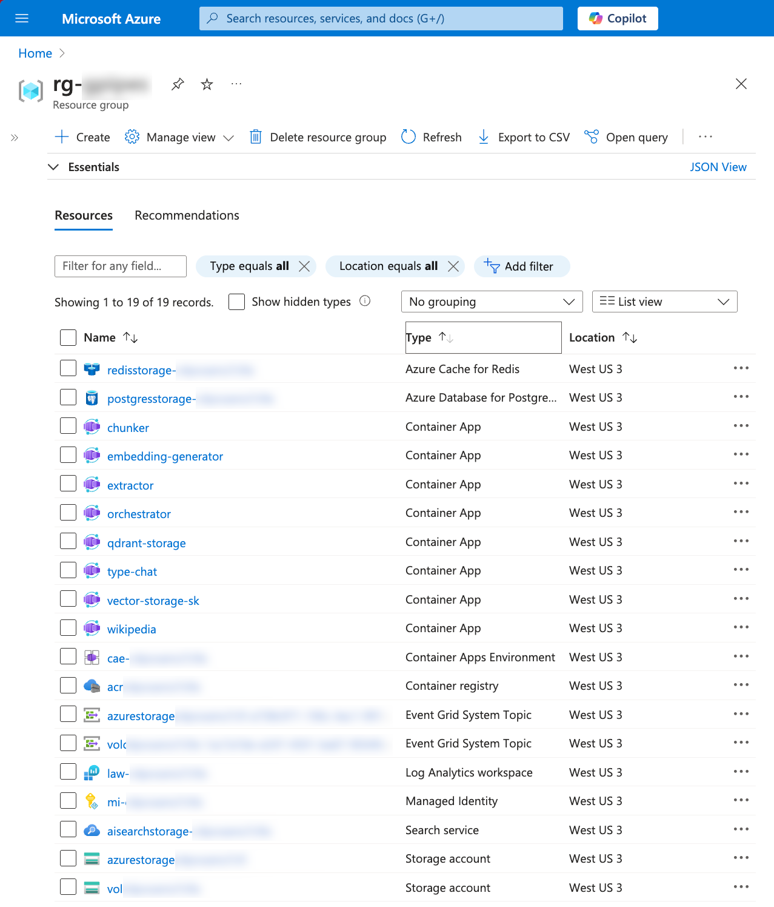
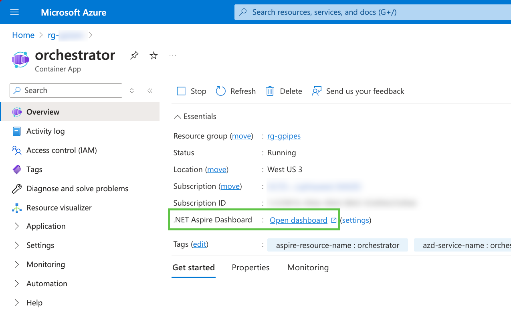

# Cloud deployment

## Production deployments

Generative Pipelines is a development tool for exploring service patterns and testing
functional composition in **local or private environments**.
While technically possible, it is **not intended to run production services**.

Generative Pipelines help identify patterns, logic, and configurations in a development setting.
Moving these insights to production requires extracting the underlying logic and integrating it
into custom-built solutions — a process beyond the scope of this project.

To transition your explorations into production, consider these Azure services:

- [Azure **Logic Apps**](https://learn.microsoft.com/azure/logic-apps/logic-apps-overview).
- [Azure **Durable Orchestrations**](https://learn.microsoft.com/azure/azure-functions/durable/durable-functions-orchestrations?tabs=csharp-inproc).
- [Azure **Data Factory** Orchestration Manager](https://learn.microsoft.com/azure/data-factory/concepts-workflow-orchestration-manager).
- [Microsoft **Fabric Apache Airflow** jobs](https://learn.microsoft.com/fabric/data-factory/apache-airflow-jobs-concepts).

## Security notes

Before getting into the deployment notes, please consider the following security notes.

> [!IMPORTANT]
> **By default the orchestrator is deployed with authentication enabled and no keys**.
> Unless you change the configuration and define two API keys, the service will not be accessible.
> You must set up access keys in Production, either editing
> [appsettings.Production.json](../service/Orchestrator/appsettings.Production.json)
> or setting the corresponding environment variables. See the orchestrator appsettings file
> for details.

- The orchestrator is meant to be the only public endpoint, restricting the available
  options to its endpoints. Tools should be deployed as private endpoints.
- The orchestrator provides no content or function out of the box. The potential of the
  deployment depends on the tools you deploy. **Choose tools carefully**, and make sure
  they are secure and well-maintained.
- Where possible **disable Access Keys and API keys**, e.g. Azure Storage, Azure AI, all
  support Entra ID and **Managed Identities**. You can use this locally too, it's a good
  practice, strongly recommended.
- All backend resources are shared with all tools. Redis, Postgres, Blobs, AI, etc.
  each have a connection string that is shared with all tools. This means that if one tool
  is compromised, all backend resources are potentially exposed. You should monitor tools
  and resources, and **restrict access** with Entra and Network Security Groups.
- The solution is **not designed for multiple tenants**. All data is shared across all tools.
  Be extremely careful when passing data that might contain sensitive information.
  If you need to work with sensitive data, consider working locally with private
  storage dependencies, or using a private single-user deployment well protected.

## Development requirements

If you're having trouble with the deployment, check [REQUIREMENTS.md](REQUIREMENTS.md)
for pre-requisites.

### Security

> [!IMPORTANT]
> **By default the orchestrator is deployed with authentication enabled and no keys**.
> Unless you change the configuration and define two API keys, the service will not be accessible.
> You must set up access keys in Production, either editing
> [appsettings.Production.json](../service/Orchestrator/appsettings.Production.json)
> or setting the corresponding environment variables. See the orchestrator appsettings file
> for details.

When working locally, you should have an environment variable `ASPNETCORE_ENVIRONMENT` set to
`Development`. This allows .NET apps to load settings from `appsettings.Development.json`.
When the env var is not set, the default is `Production`, which loads settings from
`appsettings.Production.json` (this is the case for Azure deployments).

### AZD (Azure Developer CLI)

The deployment leverages .NET Aspire and Azure Developer CLI to deploy the system to Azure. 
On the first run, the process takes a bit longer to create resource groups and resources.
On subsequent runs, the deployment should take less time. In any case, the time vary
depending on resources, number of tools, and Azure region selected.

.NET Aspire deployment takes care of packaging tools as Docker images, deploying them
and configuring environment variables.

#### First deployment

Open a terminal and run 

```
just aspire-provision
```

This will take care of building the projects and initializing the Azure environment.
Once this is complete - the process may take 30-40 minutes - run

```
just aspire-deploy
```

to deploy orchestrator and tools.

**Orchestrator** and **Tools** are deployed as Docker containers, using Azure Container Apps.

The deployment includes **Azure Storage**, a **Redis**, **Qdrant**, **Postgres**,
and **Azure AI Search** instances, used to store cache and content.

#### Following deployments

Open a terminal, and run

```
just aspire-deploy
```

to deploy all the microservices to Azure using Azure Container Apps (ACA).



## Looking at the deployment

Once the deployment is complete, you should see a new Resource Group in the Azure Portal,
looking like:



You may click on one of the container apps and find the link to .NET Aspire dashboard.



Environment variables can be found under **Application → Containers → Environment variables**.
Secrets can be found under **Settings → Secrets**.

Container apps use a Managed Identity (see the list of resources in the resource group) to access
Azure resources. This means that the container apps can access Azure resources without
storing any credentials in the code or in the environment variables.

## Current limitations

- If the deployment fails due to Azure Region or SKU limitations, the code must be changed
  manually on specific resources causing the issue. For instance, Azure AI Search is configured
  to avoid West US 3 region, where the service is/was not available.
- The orchestrator runs workflows synchronously, blocking a web request until the workflow
  completes. Work in progress to support Azure Queues.
- The orchestrator persists state on disk. Work in progress to support Azure Blob Storage.
