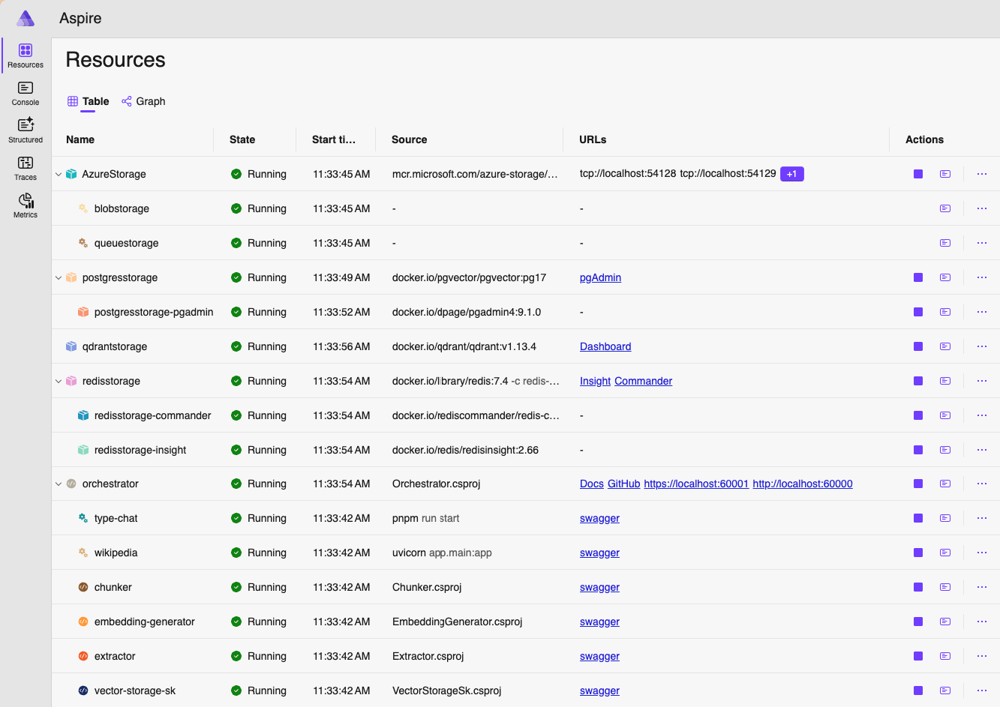

# How to develop tools and workflows

Before starting, check [REQUIREMENTS.md](REQUIREMENTS.md) for tools and software required.

# Build first

Before starting Aspire, make sure to build the system and all the resources. 
Open a terminal and from the root of the project, build all components using the following command:

    just build

The build script builds the Orchestrator, Aspire Host, and all the projects under the `tools` directory.

An alternative approach is building all the .NET projects using Visual Studio or Rider using the SLN
file in the repo. Node.js and Python tools can be built as usual with `pnpm run build` and `poetry install`.

# Start orchestrator and tools locally

The system is managed via .NET Aspire, which can be started from the command line or from an IDE.

**Starting with VS Code**

Open the project folder with VS Code, in the Solution Explorer, right-click
on infra/Aspire.AppHost and select Debug ->  Start without Debugging. This will start a terminal
showing Aspire logs. You can also switch the view to see the logs of .NET services started by
Aspire. Logs emitted by Node.js and Python services are available in the Aspire dashboard.

**Starting with Command Line**

To run the system locally, from a terminal, run `just build` and `just start`.

The `start` script launches .NET Aspire host, from the `infra/Aspire.AppHost` directory.
This will start the Aspire host, which will scan the `tools` directory for available tools, and
start each tool as a standalone web service (the services must have been built upfront).
Aspire host will also start a web service for the **Orchestrator**, **Qdrant**, **Postgres**, and **Redis**.

> 

> 
Troubleshooting

>
> If Aspire fails to start with errors about HTTPS certs like this:
>
>  > Unhandled exception. System.AggregateException: One or more errors occurred. (Unable to configure HTTPS endpoint. No server certificate was specified, and the default developer certificate could not be found or is out of date. To
generate a developer certificate run `dotnet dev-certs https`. To trust the certificate (Windows and macOS only) run `dotnet dev-certs https --trust`. For more information on configuring HTTPS
see https://go.microsoft.com/fwlink/?linkid=848054.)
>
> try running `dotnet dev-certs https --trust` or refer to the link showed.  

> 

The logs displayed on the screen provide a URL to access the Aspire dashboard.

When launching `Aspire.AppHost` from an IDE such as Visual Studio Code, Rider, or Visual Studio,
the Aspire dashboard should open automatically in your browser. Otherwise check the terminal for
the dashboard URL (which looks like https://localhost:PORT/login?t=TOKEN).

The dashboard shows list of services, their status, provides access to logs and metrics.

Important: the list of tools is automatically injected into the Orchestrator by Aspire. If the
orchestrator is launched manually or without Aspire, the list of tools injected is empty. In this
case use the Orchestrator configuration file (appsettings.json + appsettings.Development.json)
to define the list of tools (see `Tools` configuration field).

## Starting in watch mode

The watch mode is useful when making small changes to .NET code, as it will automatically apply
changes. For complex changes, it is recommended to restart Aspire, or to rebuild the service in
the IDE and restarting the relevant service in the Aspire dashboard.

To start .NET watch mode, run `dev.sh` or the following commands:

    cd infra/Aspire.AppHost
    dotnet watch

# Orchestrator settings

Like all .NET apps, the orchestrator default configuration is stored in [appsettings.json](service/Orchestrator/appsettings.json).

**When running locally**, the app uses one profile from the `launchSettings.json` file, located
in the `Properties` folder. The `launchSettings.json` file defines a `ASPNETCORE_ENVIRONMENT`
env var with value `Development`, which tells the app to load settings also from `appsettings.Development.json`,
after reading the default settings from `appsettings.json`.

**When running in the cloud**, `launchSettings.json` is not present, and the environment name
is set to `Production`. The app will load settings from `appsettings.json` first and then from
`appsettings.Production.json`.

- `appsettings.json` contains the default settings for the app.
- `appsettings.Development.json` contains settings for local development, overriding the default settings.
- `appsettings.Production.json` contains settings for production, overriding the default settings.

The same applies to all .NET tools.

# Adding tools and functions

Aspire host scans the `tools` directory for available services, ignoring those with a `_` prefix.

- **.NET projects** are discovered by their `.csproj` files. 
- **Node.js projects** are discovered by their `package.json` files.
- **Python projects** are discovered by their `pyproject.toml` files (Poetry file).
- Tools can be developed in any language, and added using Aspire AppHost coding standard.

When services are started by Aspire, the list of tools and their HTTP endpoint is automatically
injected into the Orchestrator. This allows the Orchestrator to call the tools without needing to
configure them manually.

On the other hand, if the orchestrator is launched manually or without Aspire, the list of tools
must be defined in the Orchestrator configuration file (see `Tools` configuration field).

**Important**: do not store **libraries** under the `tools` folder, as they would be discovered
by the Aspire host and considered web services to run. For .NET libraries shared by tools, consider
storing their code under `tools/_libs` folder. For Node.js and Python tools, having shared
libraries under `tools/_libs` is not recommended, as it might break Docker builds.

### Adding a .NET tool

1. `cd tools`
2. `dotnet new create webapi --name MyTool`
3. Expose a `POST /` endpoint that accepts a JSON payload and returns a JSON response.
   This will be the main function in the tool, when no function name is specified.
4. Additional functions can be added by adding new endpoints.

Optional:

- Add `Scalar.AspNetCore` and/or `Swashbuckle.AspNetCore.SwaggerUI` packages and configure Swagger.
  See `_dotnetExample` for an example.
- Change the ports in `Properties/launchSettings.json` in case of conflicts.

### Adding a Node.js tool

1. `cd tools`
2. clone the `_examples/nodejs` folder and rename it to `MyTool`
3. Expose a `POST /` endpoint that accepts a JSON payload and returns a JSON response.
   This will be the main function in the tool, when no function name is specified.
4. Additional functions can be added by adding new endpoints.

Notes:

- The project should use `pnpm` for package management.
- The project should include a `Dockerfile` for cloud deployments.

### Adding a Python tool

1. `cd tools`
2. clone the `_examples/python` folder and rename it to `MyTool`
3. Expose a `POST /` endpoint that accepts a JSON payload and returns a JSON response.
   This will be the main function in the tool, when no function name is specified.
4. Additional functions can be added by adding new endpoints.

Notes:

- The project should use `poetry` for package management.
- The project should include a `Dockerfile` for cloud deployments.

# Next Read

Dive into [JMESPATH.md](JMESPATH.md) to learn more.
