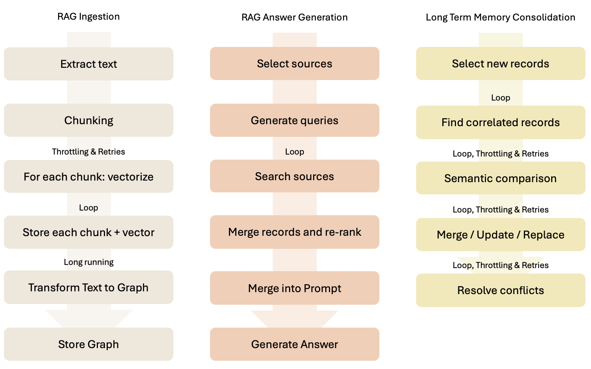

# Pipelines / Workflows

> [!NOTE]
> Terms `pipeline` and `workflow` are used interchangeably in this documentation.
> While pipelines are typically linear and workflows can include branching, the flexibility
> to compose functions and pipelines blurs the distinction. For simplicity we treat them
> as equivalent.

When writing an application, you often need to perform a series of operations on data.
Sometimes data is not even involved, for instance when invoking an LLM with a prompt
to generate a response. In these cases, you can think of the operations as a series of
steps that need to be performed in a specific order. This is where pipelines come in.

Pipelines are a way to define a sequence of operations that can be executed in a specific
order. They allow you to compose functions and data processing steps into a single unit
of work. This makes it easier to reason about complex workflows as a sequence of simple
steps.



In this project **each step is a web request to a specific endpoint**. Each endpoint is
responsible for a specific task, such as loading data, processing data, or generating
a response.

These endpoints don't have any knowledge about each other, they only follow some conventions
so that it's possible to take the output of one endpoint and use it as the input of
another endpoint.

To execute these steps, we use an Orchestrator. The Orchestrator is responsible for
managing the execution of the pipeline, including handling errors and retries. It
also provides a way to monitor the progress of the pipeline and get feedback on the
results.

To prepare the input to each function, we use special transformations, using **JMESPath**.
These transformations are responsible for taking data from the initial payload and from
previous steps, and transforming it into the input of another endpoint. This allows us
to compose functions and pipelines in a flexible way, without having to worry about
the details of how each function works.

# Example

Here's an example of what we mean by transformations and mapping. Let's assume we have
an initial input, a function to retrieve a list of users, and a function retrieving
the address of a list of users, and we want as a result a list of users + address.

Initial input:

- group ID: A05
- region: US

Tools and functions:

- Function 1: get username and ID from the given group, using web service A
- Function 2: get the address of a list of users, using web service B

Desired output:

- list of users, including ID, name, and address

**How to do this?**

Invoke the orchestrator, passing the initial data (group ID), the list of functions, and
the transformations required to map the output of one function to the input of another
function, and to render the final result.

## Function A

Let's assume the first web service has this input/output requests:

POST /search-users

```json
{
  "group": "A05"
}
```

response:

```json
{
  "users": [
    {
      "id": "s99x",
      "name": "John Doe"
    },
    {
      "id": "x728",
      "name": "Jane Doe"
    }
  ]
}
```

## Function B

And the second web service:

POST /search-addresses

```json
{
  "user_ids": [ "s99x", "x728" ],
  "region": "US"
}
```

response:
```json
{
  "addresses": [
    {
      "user_id": "s99x",
      "address": "123 Main St"
    },
    {
      "user_id": "x728",
      "address": "456 Elm St"
    }
  ]
}
```

## Desired output

The desired output is:

```json
{
  "users": [
    {
      "id": "s99x",
      "name": "John Doe",
      "address": "123 Main St"
    },
    {
      "id": "x728",
      "name": "Jane Doe",
      "address": "456 Elm St"
    }
  ]
}
```

As you can see, none of the services return the desired output (this is a common case),
and the data comes from multiple requests. Each endpoint also works with specific input
formats.

## Mapping and transforming data with JMESPath

One fundamental aspect of pipelines execution, is allowing the data to flow through the
steps, allowing each step access to data required. Steps work as functions, and data
is provided as input to each function. In order to work, the data must be transformed
in the format expected by the function. This is done using **JMESPath**.

JMESPath provides a powerful way to transform data, and it's used by the orchestrator
to map the context into a state object given in input to each function. JMESPath has some
conventions around numbers, strings, and booleans, so please refer to the documentation
for more details, see [JMESPATH.md](JMESPATH.md).

The initial input:

```json
{ "groupId": "A05", "region": "US" }
```

needs to be transformed to the input of the first function:

```json
{ "group": "A05" }
```

JMESPath expression:

> { group: start.groupId }


which produces:

```json
{ "group": "A05" }
```

Note: the `start.` prefix is used to indicate that the value comes from the initial input.
This is a convention used in this project to avoid confusion with other values.

The output of the first function needs to be transformed to the input of the second function:

```json
{ "user_ids": [ "s99x", "x728" ], "region": "US" }
```

JMESPath expression:

> { user_ids: users[].id, region: start.region }

which produces:

```json
{ "user_ids": [ "s99x", "x728" ], "region": "US" }
```

Then finally, the output of the second function (name + address) needs to be combined
with the output of the first function (id + name), into a single array to generate
the desired output. Here's the JMESPath expression:

> { users: users[].{ id: id, name: name, address: addresses[?user_id == id].address } }

## Defining the pipeline

Putting all together, this is what the pipeline looks like:

> Input:
> 
>   `{ "groupId": "A05", "region": "US" }`
>
> Prepare input for function A:
> 
>   `{ group: start.groupId }`
>
> Call function A:
> 
>   `POST /search-users`
> 
> Prepare input for function B:
> 
>   `{ user_ids: users[].id, region: start.region }`
>
> Call function B:
>
>   `POST /search-addresses`
> 
> Prepare output:
> 
>   `{ user_ids: users[].id, region: start.region }`

## Executing the pipeline

Pipelines are executed by the Orchestrator. The current solution includes a synchronous
orchestrator, which means that the pipeline is executed in a single request. This
is useful for quick pipelines that can be completed in few seconds. For longer workflows,
we will introduce an asynchronous orchestrator, which will allow you to execute pipelines
in the background. This will be useful for long-running tasks that can take minutes
or hours to complete.

To execute the pipeline you can call the Orchestrator web service, passing all the
information seen above. There is no need to create files or configuration, as long
as the orchestrator is up and running, it takes only one web request.

The orchestrator provides a `POST /api/jobs` endpoint which supports JSON and YAML requests.
Let's start with JSON, and see the equivalent YAML later. Often a pipeline is more
readable using multi-line strings, which are not supported by JSON, so YAML is usually
preferred.

To execute the pipeline above, send this request:

```http request
POST <orchestrator>/api/jobs
Content-Type: application/json
```

```json
{
  "groupId": "A05",
  "region":  "US",
  "_workflow":{
    "steps": [
      {
        "function": "users/search-users",
        "xin":      "{ group: start.groupId }"
      },
      {
        "function": "users/search-addresses",
        "xin":      "{ user_ids: users[].id, region: start.region }",
        "xout":     "{ users: users[].{ id: id, name: name, address: addresses[?user_id == id].address } }"
      }
    ]
  }
}
```


# Next Read

Dive into [CONVENTIONS.md](CONVENTIONS.md) to learn more.
