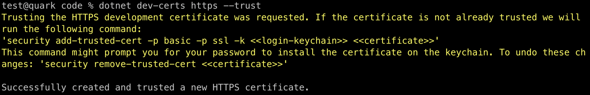
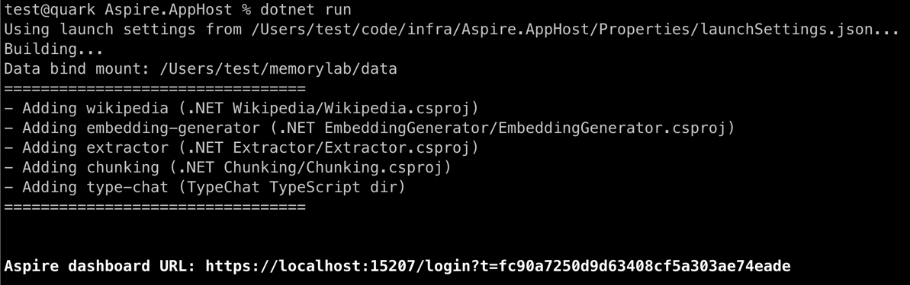
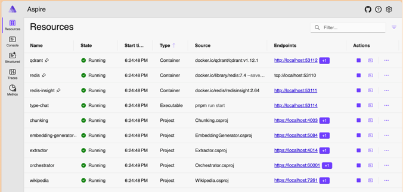

This document describes how to quickly get started with the project to test its functionalities.

For a more involved setup, refer to [DEVELOPMENT.md](DEVELOPMENT.md).

Before starting, check [REQUIREMENTS.md](REQUIREMENTS.md) for tools and software required.

# Run the service locally

Before starting Aspire, make sure to build the system and all the resources. Open a terminal and
from the root of the project, build and then start the services, using the following commands:

    # Build all projects (.NET, Node.JS, Python)
    just build

    # Launch Aspire and all projects
    just start

The `build` script builds the Orchestrator and all the projects under the `tools` directory, which
contains .NET, Node.Js and Python projects.

The `start` script launches .NET Aspire host, from the `infra/Aspire.AppHost` directory.
This will start the Aspire host, which will scan the `tools` directory for available tools, and
start each tool as a standalone web service (the services must have been built upfront).
Aspire host will also start a web service for the **Orchestrator**, and some Docker images including
Postgres, Qdrant and Redis.

> <details>
> <summary>Troubleshooting</summary>
>
> If Aspire fails to start with errors about HTTPS certs like this:
>
>  > Unhandled exception. System.AggregateException: One or more errors occurred. (Unable to configure HTTPS endpoint. No server certificate was specified, and the default developer certificate could not be found or is out of date. To
> > generate a developer certificate run `dotnet dev-certs https`. To trust the certificate (Windows and macOS only) run `dotnet dev-certs https --trust`. For more information on configuring HTTPS
> > see https://go.microsoft.com/fwlink/?linkid=848054.)
>
> try running `dotnet dev-certs https --trust` or refer to the link showed.<br/><br/>

> 
> If Node.js projects fail to build, make sure that you have the correct version of Node.js enabled
> e.g. running `node --version`.
> </details>

The logs displayed on the screen provide a URL to access the Aspire dashboard.



When launching `Aspire.AppHost` from an IDE such as Visual Studio Code, Rider, or Visual Studio,
the Aspire dashboard should open automatically in your browser. Otherwise check the terminal for
the dashboard URL (which looks like https://localhost:PORT/login?t=TOKEN).

The dashboard shows the list of services, their status, provides access to logs and metrics.



From the dashboard you can access the logs of each service, for instance to check why a resource
might have stopped.

Please note that the Orchestrator is always running on port `60000` (60001 HTTPS), while other
resources use ports dynamically assigned each time the Aspire host starts.

**Unless you're debugging a specific tool, you should only send requests to the Orchestrator
on port `60000` (or 60001 HTTPS).**

# Test the wikipedia tool

The Wikipedia tool is a simple web service that retrieves the content of a Wikipedia page.
It's used for testing purposes, such as providing content to process with other tools.

**Check the dashboard and find the port** used by the Wikipedia resource, then update and execute
the following command:

**Bash:**

```bash
PORT=55555
curl -X POST "http://localhost:${PORT}/en" -H "Content-Type: application/json" -d '{"title": "Moon"}'
```

**PowerShell:**

```powershell
$PORT = 55555
Invoke-RestMethod -Uri "http://localhost:$PORT/en" -Method Post -Headers @{ "Content-Type" = "application/json" } -Body '{"title": "Moon"}'
```

The response should be a JSON object containing the content of the Wikipedia page for “Moon”,
including `title` and `content` fields.

> <details>
> <summary>Troubleshooting</summary>
>
> Troubleshooting:
> - Verify that Aspire has started correctly and is running.
> - Check the Aspire dashboard to confirm that the Wikipedia service is active.
> - Ensure that the Wikipedia service is configured to use TCP port `5021` in the dashboard.
> </details>

# Test the orchestration

**Using Just**

From the root of the repository, run:

    just test-orchestrator

**Bash:**

```bash
curl -X POST 'http://localhost:60000/api/jobs' \
  -H 'content-type: application/json' \
  -d '{"_workflow":{"steps":[{"xin":"{title:'\''Trope'\''}","function":"wikipedia/en","xout":"state.content"}]}}'
```

(If you have `jq` installed, add `| jq` at the end to format the output)

**Powershell:**

```powershell
Invoke-RestMethod -Uri "http://localhost:60000/api/jobs" -Method Post `
    -Headers @{ "Content-Type" = "application/json" } `
    -Body ('{"_workflow":{"steps":[{"xin":"{ title: ''Trope''}","function":"wikipedia/en","xout":"state.content"}]}}') `
    | ConvertTo-Json -Depth 5
```

You should see a text from Wikipedia. 

Feel free to play with the content of `xout` transformation to see how the data is transformed using
JMESPath, e.g. try
- `"xout":"{ id: state.title }"`
- `"xout":"length(state.content)"`
- `"xout":"state"` 
- remove the `xout` field

# Chunking content

Let's use the orchestrator now to fetch some Spanish content from Wikipedia, chunk it, and show the first 3 chunks.
Note how we use "wikipedia/es" rather than "wikipedia/en", two separate "functions" defined inside the wikipedia tool.
See http://localhost:60000/ (web page) or http://localhost:60000/tools (raw JSON) for the list of available tools and functions.

For reference, here's the workflow. Note the embedding settings under `input`.

```json
{
  "_workflow": {
    "steps": [
      {
        "function": "wikipedia/es",
        "xin": "{ title: start.input.title }"
      },
      {
        "function": "chunker/chunk",
        "xin": "{ text: state.content, maxTokensPerChunk: start.input.chunkSize }",
        "xout": "state.chunks[:3]"
      }
    ]
  },
  "input": {
    "title": "unicornio",
    "chunkSize": 100
  }
}
```

**Bash:**

```shell
curl -X POST 'http://localhost:60000/api/jobs' -H 'Content-Type: application/json' \
  -d '{"_workflow":{"steps":[{"function":"wikipedia/es", "xin": "{title:start.input.title}"},{"function":"chunker/chunk","xin":"{ text: state.content, maxTokensPerChunk: start.input.chunkSize }","xout":"state.chunks[:3]"}]},"input":{"title":"unicornio","chunkSize":100}}'
```

(if you have `jq` installed, add `| jq` at the end to format the output)

**Powershell:**

```powershell
Invoke-RestMethod -Uri "http://localhost:60000/api/jobs" -Method Post `
    -Headers @{ "Content-Type" = "application/json" } `
    -Body ('{"_workflow":{"steps":[{"xin": "{title:start.input.title}","function":"wikipedia/es"},{"function":"chunker/chunk","xin":"{ text: state.content, maxTokensPerChunk: start.input.chunkSize }","xout":"state.chunks[:3]"}]},"input":{"title":"unicornio","chunkSize":100}}') `
    | ConvertTo-Json -Depth 5
```

Let's try using the YAML syntax.

**Bash:**

```shell
curl -X POST 'http://localhost:60000/api/jobs' \
  -H 'Content-Type: text/yaml' \
  --data-binary @- <<'EOF'
_workflow:
  steps:
    - function: wikipedia/es
      xin: "{ title: start.input.title }"
    - function: chunker/chunk
      xin: "{ text: state.content, maxTokensPerChunk: start.input.chunkSize }"
      xout: "state.chunks[:3]"
input:
  title: unicornio
  chunkSize: 100
EOF
```

**Powershell:**

```powershell
$body = @"
_workflow:
  steps:
    - function: wikipedia/es
      xin: "{ title: start.input.title }"
    - function: chunker/chunk
      xin: "{ text: state.content, maxTokensPerChunk: start.input.chunkSize }"
      xout: "state.chunks[:3]"
input:
  title: unicornio
  chunkSize: 100
"@

Invoke-RestMethod -Uri "http://localhost:60000/api/jobs" -Method Post -ContentType "text/yaml" -Body $body
```

You should see a JSON array with 3 chunks of text.


# Generate embeddings for a file

This is a more realistic scenario, taking in input a file, extracting the content, chunking the text,
and calculating the embeddings for each chunk.

Files can be uploaded by including their base64-encoded content in a JSON payload, or using the usual
multipart/form-data method. For brevity this example uses the base64-encoding approach.

## LLM configuration

Since the code requires an LLM to generate embeddings, you have a couple of options:

1. Store OpenAI API key in `tools/EmbeddingGenerator/appsettings.Development.json` (key: `App.OpenAI.ApiKey`),
   and use an OpenAI model.
2. Define your Azure Open AI deployments in `tools/EmbeddingGenerator/appsettings.Development.json`,
   and use either an API key or Entra auth.
3. Pass AI endpoint and model details in the workflow, including auth settings. This approach works
   for OpenAI and Azure OpenAI using the `embedding-generator/custom` function rather than the
   default `embedding-generator` function.

This being a Quickstart, we will use the last option to skip configuration steps. However,
if you plan to develop workflows, you should edit `tools/EmbeddingGenerator/appsettings.Development.json`
and set up your models and credentials. This will allow us to keep workflows simple and free of
personal settings and credentials.

## Upload, extract, chunk, and generate embeddings

For reference, here's the workflow in JSON and YAML format. Note the embedding settings under `config`.

```json
{
  "config": {
    "embEndpoint":   "https://contoso.cognitiveservices.azure.com/",
    "embDeployment": "text-embedding-3-small",
    "embCustomDims": true,
    "chunkSize":     1000
  },
  
  "fileName": "example.docx",
  "content":  "...",
  
  "_workflow": {
    "steps": [
      {
        "function": "extractor/extract"
      },
      {
        "function": "chunker/chunk",
        "id":       "chunking", // This name is used below to reference the chunks generated in this step
        "xin":      "{ text: state.fullText, maxTokensPerChunk: start.config.chunkSize }",
        "xout":     "{ chunks: state.chunks }"
      },
      {
        "function": "embedding-generator/vectorize-custom",
        "xin":      "{ provider: 'azureai', endpoint: start.config.embEndpoint, modelId: start.config.embDeployment, inputs: chunking.out.chunks, supportsCustomDimensions: start.config.embCustomDims, dimensions: `5` }"
      }
    ]
  }
}
```

```yaml
config:
  embEndpoint:   https://contoso.cognitiveservices.azure.com/
  embDeployment: text-embedding-3-small
  embCustomDims: True # This is a string, not a boolean, and it's transformed to bool inside the expression below
  chunkSize:     1000

fileName: example.docx
content:  ...

_workflow:
  steps:
    - function: extractor/extract
    - function: chunker/chunk
      id:       chunking # This name is used below to reference the chunks generated in this step
      xin: >
        {{
            text:              state.fullText, 
            maxTokensPerChunk: start.config.chunkSize
        }}
      xout: >
        {{
            chunks: state.chunks
        }}
    - function: embedding-generator/vectorize-custom
      xin: >
        {{
            provider:                 'azureai',
            endpoint:                 start.config.embEndpoint,
            modelId:                  start.config.embDeployment, 
            inputs:                   chunking.out.chunks,
            dimensions:               `5`,
            supportsCustomDimensions: contains(['true','True'], start.config.embCustomDims)
        }}
```

Adjust the **Azure variables** below and execute this command in Bash/Powershell or the equivalent Python/Node.JS code **from the examples folder**.

### Bash

```bash
ENDPOINT="https://contoso.cognitiveservices.azure.com/"
DEPLOYMENT="text-embedding-3-small"
CONTENT=`base64 -i examples/example.docx`

curl -X POST "http://localhost:60000/api/jobs" \
     -H "Content-Type: application/json" \
     -d "{\"_workflow\":{\"steps\":[{\"function\":\"extractor/extract\"},{\"function\":\"chunker/chunk\",\"id\":\"chunking\",\"xin\":\"{ text: state.fullText, maxTokensPerChunk: start.config.chunkSize }\",\"xout\":\"{ chunks: state.chunks }\"},{\"function\":\"embedding-generator/vectorize-custom\",\"xin\":\"{ provider: 'azureai', endpoint: start.config.embEndpoint, modelId: start.config.embDeployment, inputs: chunking.out.chunks, supportsCustomDimensions: start.config.embCustomDims, dimensions: \`5\` }\"}]},\"config\":{\"chunkSize\":1000,\"embEndpoint\":\"$ENDPOINT\",\"embDeployment\":\"$DEPLOYMENT\",\"embCustomDims\":true},\"fileName\":\"example.docx\",\"content\":\"$CONTENT\"}"
```

### Python (remember to adjust the config):

Source code: [examples/quickstart.py](../examples/quickstart.py)

```python
AzureEmbeddingEndpoint = "https://contoso.cognitiveservices.azure.com/"
AzureEmbeddingDeployment = "text-embedding-3-small"

import json
import requests
import base64

with open("example.docx", "rb") as file:
    content_base64 = base64.b64encode(file.read()).decode("utf-8")

yaml_payload = f"""\
config:
  embEndpoint: {AzureEmbeddingEndpoint}
  embDeployment: {AzureEmbeddingDeployment}
  embCustomDims: True
  chunkSize: 1000

fileName: example.docx
content: {content_base64}

_workflow:
  steps:
    - function: extractor/extract
    - function: chunker/chunk
      id: chunking
      xin: >
        {{
            text: state.fullText, 
            maxTokensPerChunk: start.config.chunkSize
        }}
      xout: >
        {{
            chunks: state.chunks
        }}
    - function: embedding-generator/vectorize-custom
      xin: >
        {{
            provider: 'azureai',
            endpoint: start.config.embEndpoint,
            modelId:  start.config.embDeployment, 
            inputs:   chunking.out.chunks,
            supportsCustomDimensions: contains(['true','True'], start.config.embCustomDims),
            dimensions: `5`
        }}
"""

headers = {"Content-Type": "application/x-yaml"}
response = requests.post("http://localhost:60000/api/jobs", headers=headers, data=yaml_payload)

response_json = response.json()
print(json.dumps(response_json, indent=4))
```

Note: when using YAML, booleans must be handled carefully, to avoid JSON parsing errors.

### Node.JS  (remember to adjust the config):

Source code: [examples/quickstart.js](../examples/quickstart.js)

```javascript
const AzureEmbeddingEndpoint = "https://contoso.cognitiveservices.azure.com/";
const AzureEmbeddingDeployment = "text-embedding-3-small";

const fs = require("fs");

const filePath = "example.docx";
const apiUrl = "http://localhost:60000/api/jobs";

const contentBase64 = fs.readFileSync(filePath, "base64");

const json_payload = {
    config: {
        embEndpoint: AzureEmbeddingEndpoint,
        embDeployment: AzureEmbeddingDeployment,
        embCustomDims: true,
        chunkSize: 1000,
    },
    fileName: "example.docx",
    content: contentBase64,

    _workflow: {
        steps: [
            {function: "extractor/extract"},
            {
                function: "chunker/chunk",
                id: "chunking",
                xin: "{ text: state.fullText, maxTokensPerChunk: start.config.chunkSize }",
                xout: "{ chunks: state.chunks }",
            },
            {
                function: "embedding-generator/vectorize-custom",
                xin: `{
                provider: 'azureai',
                endpoint: start.config.embEndpoint,
                modelId: start.config.embDeployment,
                inputs: chunking.out.chunks,
                supportsCustomDimensions: start.config.embCustomDims, 
                dimensions: \`5\`
             }`,
            },
        ],
    },
};

fetch(apiUrl, {
    method: "POST",
    headers: {"Content-Type": "application/json"},
    body: JSON.stringify(json_payload),
})
    .then((res) => res.json())
    .then((data) => console.log(JSON.stringify(data, null, 4)))
    .catch((err) => console.error("Error:", err));
```

If everything works correctly, the service should return this output:

```json
{
  "promptTokens": 2490,
  "totalTokens": 2490,
  "embeddings": [
    [
      0.36579874,
      0.2515621,
      -0.38964206,
      0.7346156,
      0.33380646
    ],
    [
      0.55465066,
      0.2599786,
      -0.16245882,
      0.58534104,
      -0.505724
    ],
    [
      0.7383473,
      0.22672509,
      0.48869792,
      0.36069298,
      -0.18577941
    ]
  ]
}
```

> <details>
> <summary>Troubleshooting</summary>
>
> - Run the code from the examples folder of the repository, and make sure the `example.docx` file exists.
> - Try changing `embCustomDims` to `false` in the payload. If it works, then the model selected does not support custom dimensions. 
> - Verify that Aspire has started correctly and is running.
> - Check the Aspire dashboard to confirm that `extractor`, `chunker` and `embedding-generator` services are active and healthy with a green icon.
> - Verify the Azure OpenAI details in the payload, both endpoint and deployment name should exist.
> - Verify that Azure OpenAI is accessible with your credentials. 
> - If running the python code, try `print(response.text)` to see the raw response from the server.
> </details>


# Next Read

Dive into [PIPELINES-INTRO.md](PIPELINES-INTRO.md) to learn more.

