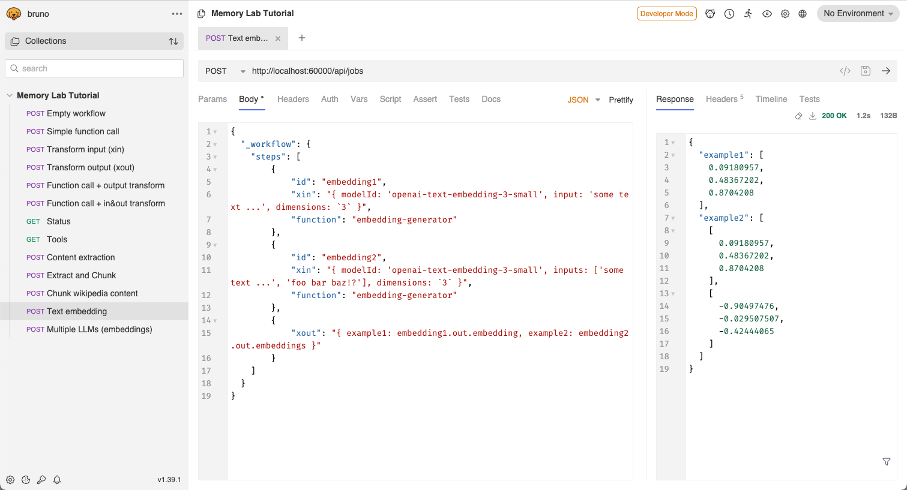

# REST API tutorial

The folder contains a list of API request examples showing how to use the orchestrator API.

Setup:

- Install [Bruno](https://www.usebruno.com/downloads) on your computer.
- Launch Bruno, click "Open Collection" and point it to this folder.
- You can run the example in Developer Mode, there is no JS in the examples.

